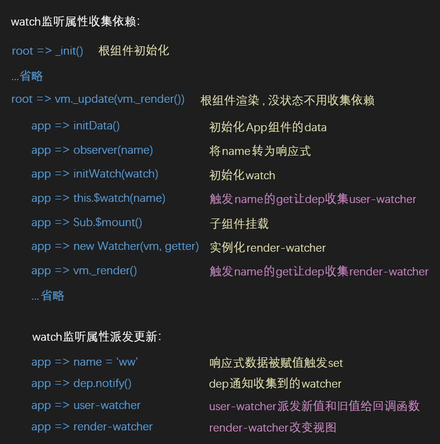
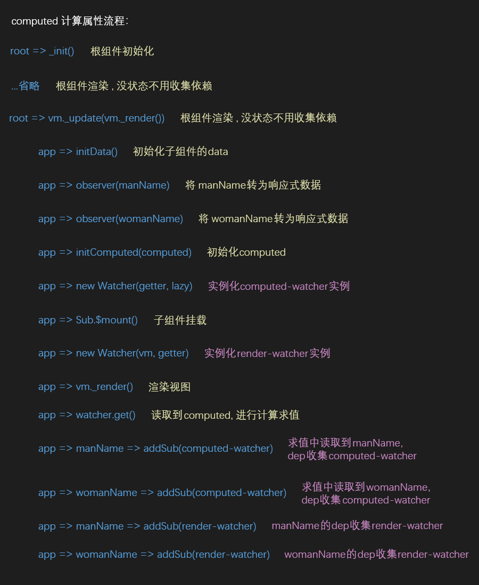

#### nextTick
当我们短时间内多次改变数据，并且要将其渲染在页面上时，如果数据被改变一次，dom就重新渲染一次，无疑这是非常耗费性能的。因此，vue采用了异步更新，数据变动完成后，同一更新视图。

当我们数据变动时，发生了以下几个步骤：
1. 进入到该属性的setter方法中，然后调用`dep.notify()`
2. notity方法中遍历subs数组（里面是所有的订阅者）,调用了订阅者的`subs[i].update`方法
3. update方法中，如果是渲染watcher, 不会立即执行渲染操作，而是调用`queueWatcher(this)`方法，将其添加到异步队列当中
4. queueWatcher方法中，将watcher去重后，调用`nextTick(flushSchedulerQueue)`方法，其中nextTick方法是使用了优雅降级的一个方式: promise/mutationObserver/setImmediate/setTimeout，使flushSchedulerQueue异步执行, flushSchedulerQueue中执行所有的watcher更新, 然后重置异步队列为空。

#### watch监听实现原理

#### computed实现原理

#### diff算法
https://juejin.cn/post/6844903607913938951

#### keep-alive
https://juejin.cn/post/6844904116620099591
在内部定义了两个对象，cache用来保存需要被缓存的组件实例；keys用于保存缓存组件的key；当`keep-alive`中渲染一个需要被缓存的组件实例时：
- 判断缓存中是否已经缓存了该组件的实例，如果是则直接读取并返回；并调整key在keys中的位置，将其从原来的位置删除，放到最后一个；（LRU置换策略）
- 如果没有缓存，则缓存该实例。若keys的长度大于max, 则移除第一个。
